<p align="center">
    
    <br><strong><font size=50>KK商城</font></strong>
    <br>`kkmall` 项目致力于打造一个完整的电商系统，整体采用现阶段流行技术来实现，后台采用前后端分离技术编写。
    <br>    
</p>
<p align="center">
    <a href="https://github.com/kirklin/kkmall/stargazers"></a>
    <a href="https://github.com/kirklin/kkmall/network/members"></a>
    <a href="https://github.com/kirklin/kkmall/issues"></a>
    <a href="https://sitoi.github.io/kkmall"></a>
</p>

### 项目API接口文档

- 文档地址：[https://easydoc.xyz/s/78237135/ZUqEdvA4/hKJTcbfd]()

### 项目介绍

kkmall（KK商城） 项目是一套电商项目，包括前台商城系统以及后台管理系统，基于 SpringCloud + SpringCloudAlibaba + MyBatis-Plus实现，采用 Docker
容器化部署。前台商城系统包括：用户登录、注册、商品搜索、商品详情、购物车、下订单流程、秒杀活动等模块。后台管理系统包括：系统管理、商品系统、优惠营销、库存系统、订单系统、用户系统、内容管理等七大模块。

### 项目演示

#### **前台部分功能演示效果**

##### **首页展示**

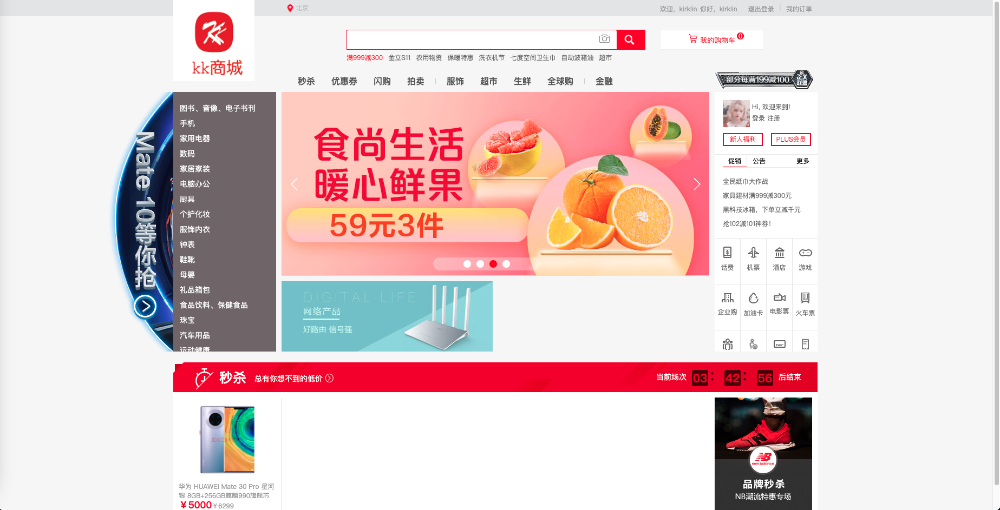

##### **检索展示**

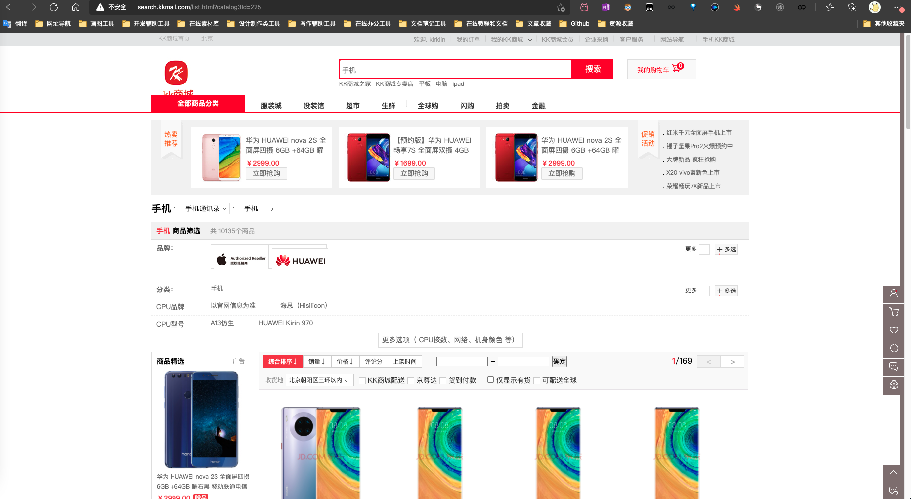
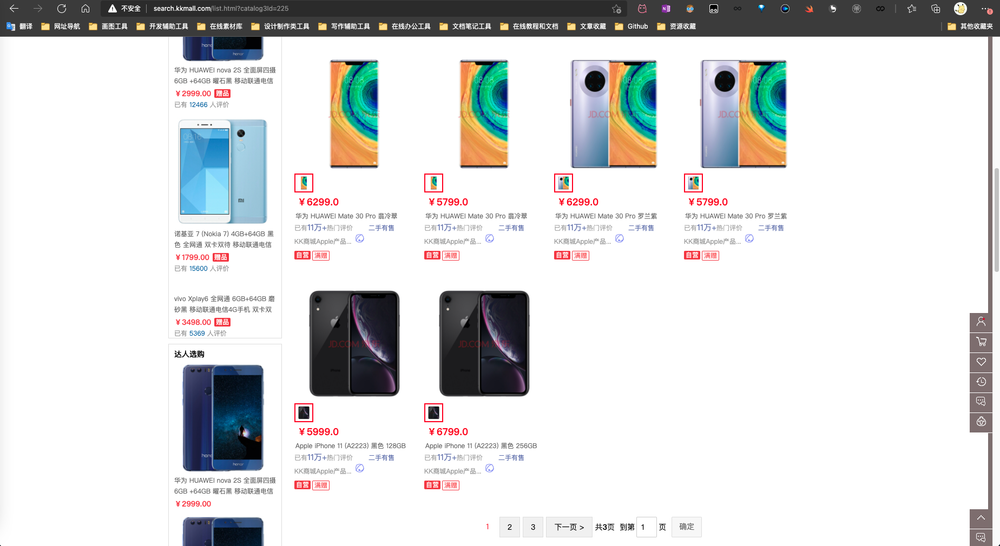

##### **商品详情展示**

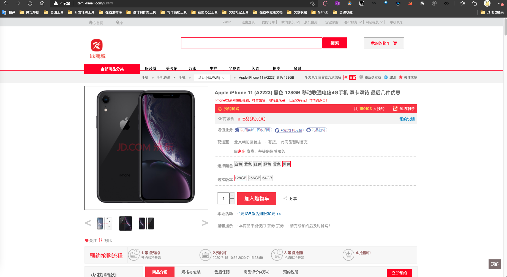

##### **购物车展示**

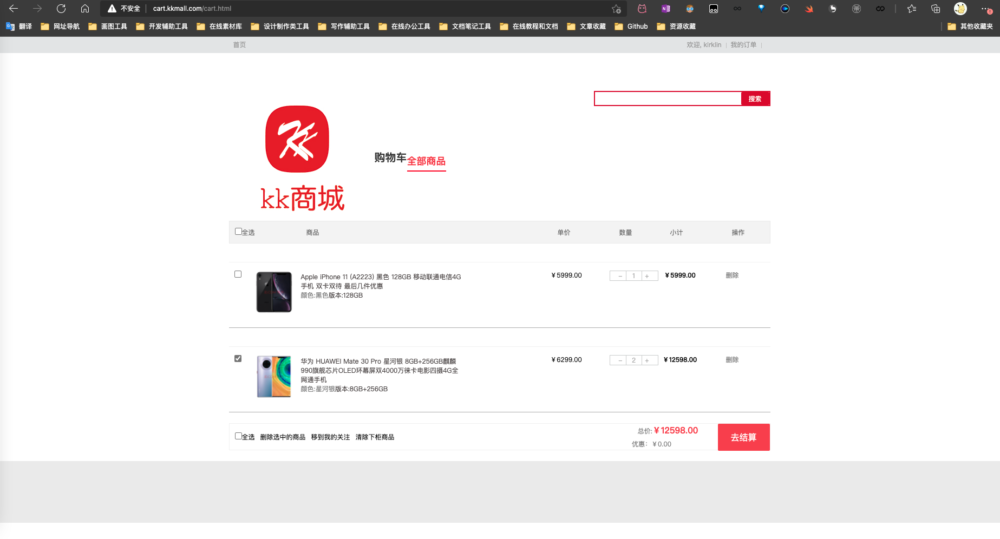

##### **订单展示**

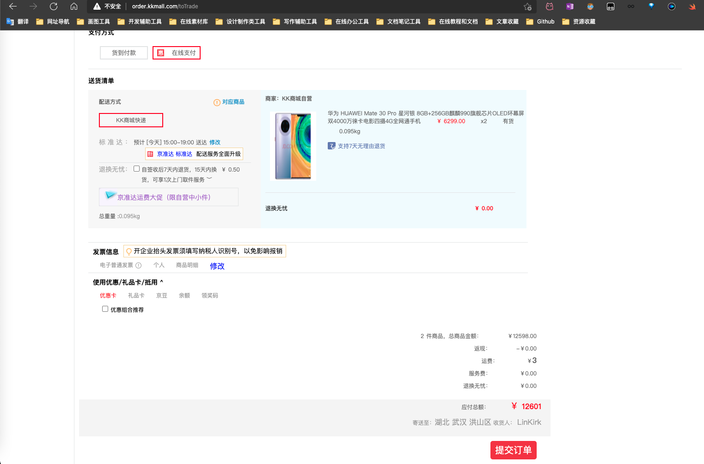

##### **支付展示**

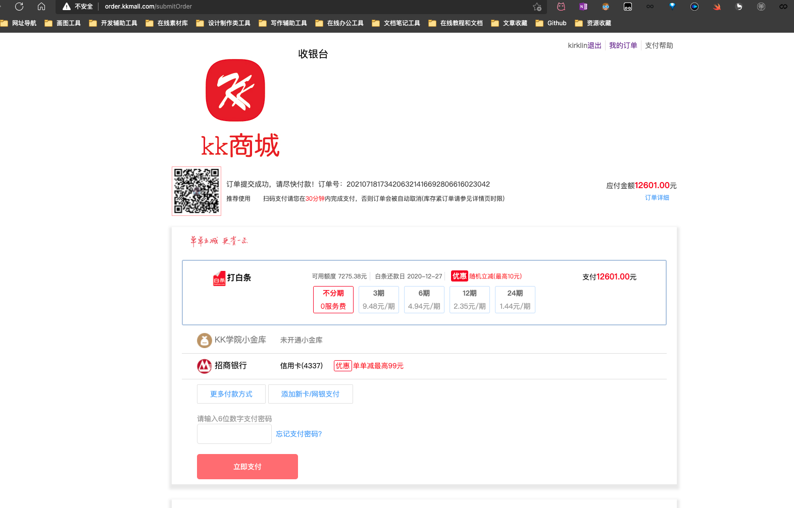

##### **订单列表展示**

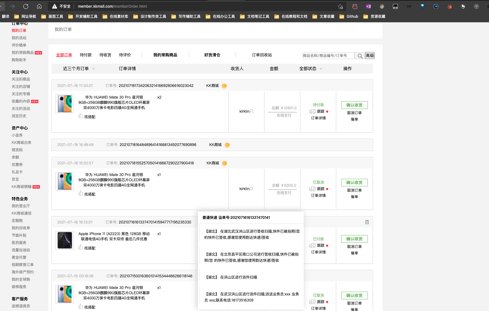

##### **支付宝沙箱支付展示**

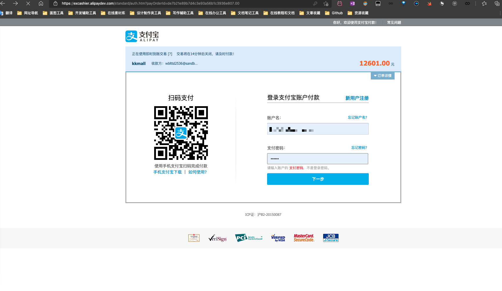

#### 后端登录界面

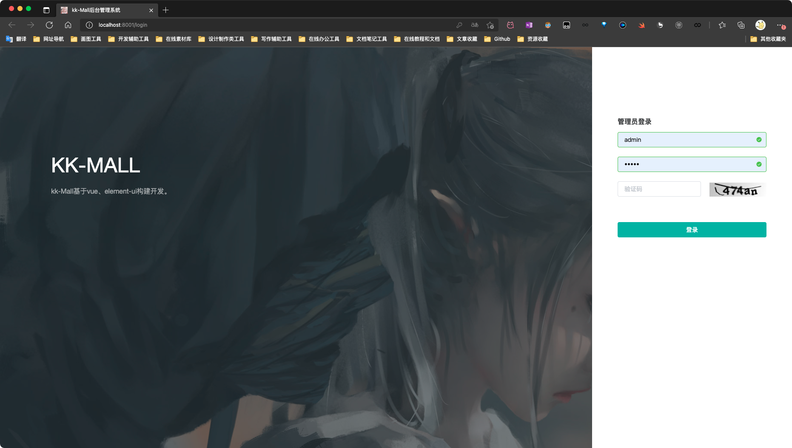

#### 主页面

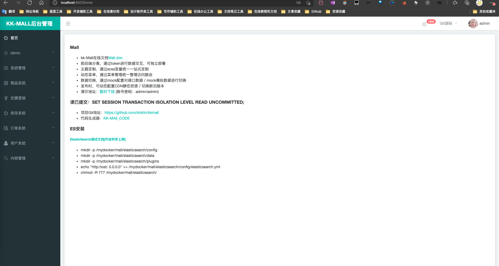

#### 链路追踪

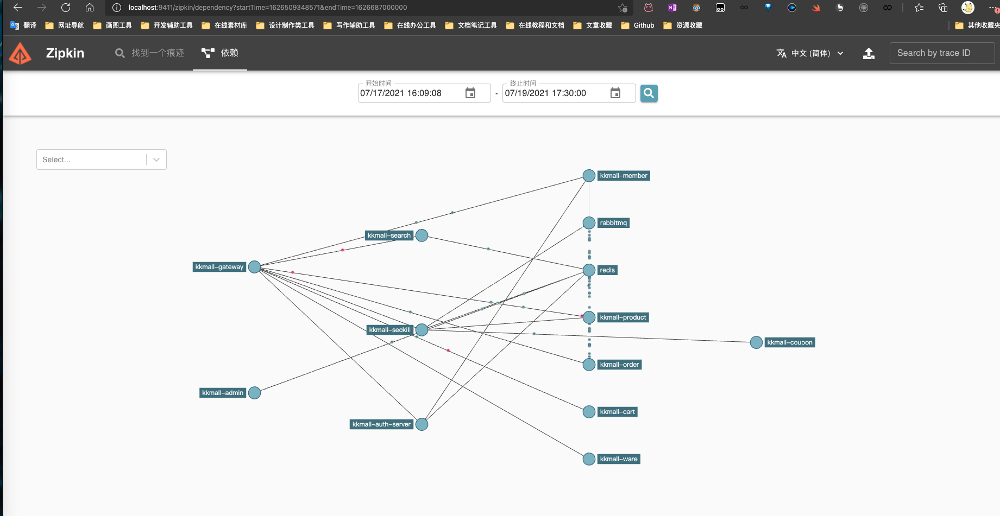

### 组织结构

```
kkmall
├── kkmall-common -- 工具类及通用代码
├── renren-generator -- 人人开源项目的代码生成器
├── kkmall-auth-server -- 认证中心（社交登录、OAuth2.0、单点登录）
├── kkmall-cart -- 购物车服务
├── kkmall-coupon -- 优惠卷服务
├── kkmall-gateway -- 统一配置网关
├── kkmall-order -- 订单服务
├── kkmall-product -- 商品服务
├── kkmall-search -- 检索服务
├── kkmall-seckill -- 秒杀服务
├── kkmall-third-party -- 第三方服务
├── kkmall-ware -- 仓储服务
└── kkmall-member -- 会员服务

```

### 技术选型

**后端技术**

|        技术        |           说明           |                      官网                       |
| :----------------: | :----------------------: | :---------------------------------------------: |
|     SpringBoot     |       容器+MVC框架       |     https://spring.io/projects/spring-boot      |
|    SpringCloud     |        微服务架构        |     https://spring.io/projects/spring-cloud     |
| SpringCloudAlibaba |        一系列组件        | https://spring.io/projects/spring-cloud-alibaba |
|    MyBatis-Plus    |         ORM框架          |             https://mp.baomidou.com             |
|  renren-generator  | 人人开源项目的代码生成器 |   https://gitee.com/renrenio/renren-generator   |
|   Elasticsearch    |         搜索引擎         |    https://github.com/elastic/elasticsearch     |
|      RabbitMQ      |         消息队列         |            https://www.rabbitmq.com             |
|   SpringSession    |        分布式缓存        |    https://projects.spring.io/spring-session    |
|      Redisson      |         分布式锁         |      https://github.com/redisson/redisson       |
|       Docker       |       应用容器引擎       |             https://www.docker.com              |
|        OSS         |        对象云存储        |  https://github.com/aliyun/aliyun-oss-java-sdk  |

**前端技术**

|   技术    |    说明    |           官网            |
| :-------: | :--------: | :-----------------------: |
|    Vue    |  前端框架  |     https://vuejs.org     |
|  Element  | 前端UI框架 | https://element.eleme.io  |
| thymeleaf |  模板引擎  | https://www.thymeleaf.org |
|  node.js  | 服务端的js |   https://nodejs.org/en   |

### 架构图

**系统架构图**

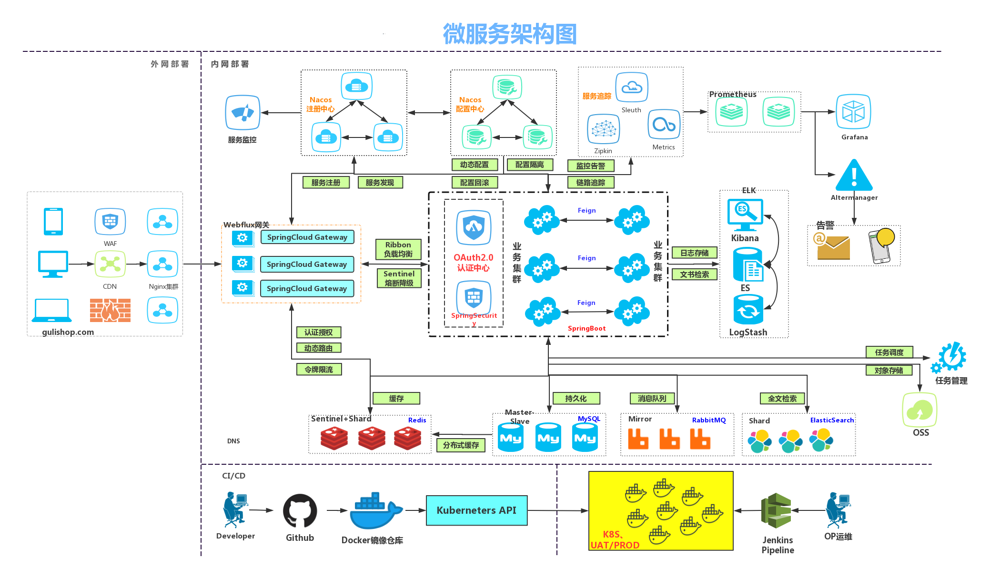

### 环境搭建

#### 开发工具

|     工具      |        说明         |                      官网                       |
| :-----------: | :-----------------: | :---------------------------------------------: |
|     IDEA      |    开发Java程序     |     https://www.jetbrains.com/idea/download     |
| RedisDesktop  | redis客户端连接工具 |        https://redisdesktop.com/download        |
|  SwitchHosts  |    本地host管理     |       https://oldj.github.io/SwitchHosts        |
|    X-shell    |  Linux远程连接工具  | http://www.netsarang.com/download/software.html |
|    DataGrip    |   数据库连接工具    |       https://www.jetbrains.com/datagrip/       |
| PowerDesigner |   数据库设计工具    |             http://powerdesigner.de             |
|    Postman    |   API接口调试工具   |             https://www.postman.com             |
|    Jmeter     |    性能压测工具     |            https://jmeter.apache.org            |
|    Typora     |   Markdown编辑器    |                https://typora.io                |

#### 开发环境

|     工具      | 版本号 |                             下载                             |
| :-----------: | :----: | :----------------------------------------------------------: |
|      JDK      |  1.8   | https://www.oracle.com/java/technologies/javase/javase-jdk8-downloads.html |
|     Mysql     | 8.0.23 |                    https://www.mysql.com                     |
|     Redis     | Redis  |                  https://redis.io/download                   |
| Elasticsearch | 7.13.2  |               https://www.elastic.co/downloads               |
|    Kibana     | 7.13.2  |               https://www.elastic.co/cn/kibana               |
|   RabbitMQ    | 3.8.14  |            http://www.rabbitmq.com/download.html             |
|     Nginx     | 1.19.6  |              http://nginx.org/en/download.html               |

注意：以上的除了jdk都是采用docker方式进行安装，详细安装步骤可参考百度!!!

## 历史Star

[](https://starchart.cc/kirklin/kkmall)
      
